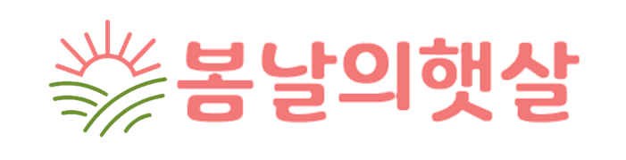
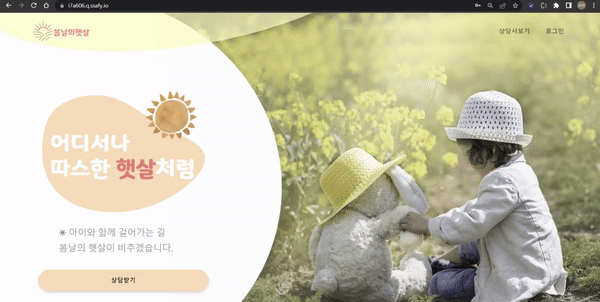
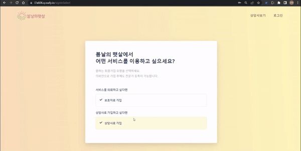
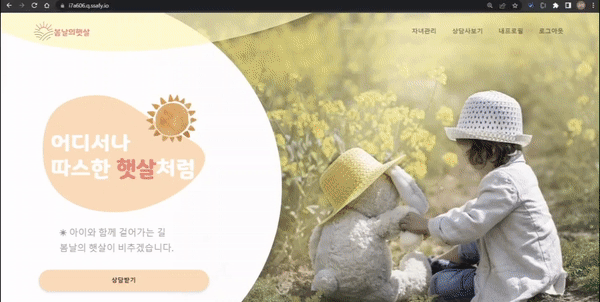
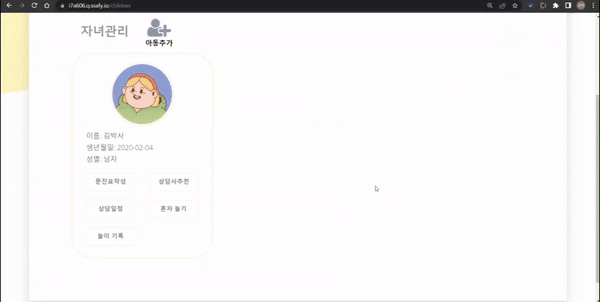
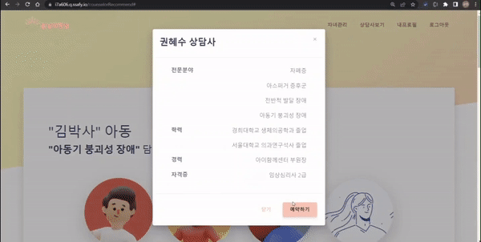

## ☀️ 봄날의 햇살

---

> WebRTC 기반 자폐 아동 상담 플랫폼 <br>
> 김규란 이준경 최지혜 배한빈 성지훈 이봄

## 📌 목차

---

- [프로젝트 소개](#📁-프로젝트-소개)
  - [프로젝트 목표](#✒️-프로젝트-목표)
  - [프로젝트 기간](#📆-프로젝트-기간)
  - [기술스택](#⚙️-기술스택)
  - [구현 기능](#🔎-구현-기능)
- [산출물](#📄-산출물)
  - [ERD Diagram]
  - [기능 명세서]
  - [API 명세서]
  - [유저스토리]
  - [서버 아키텍처]
- [주요 화면]

## 📁 프로젝트 소개

---

### ✒️ 프로젝트 목표

- 자폐 아동의 증상 데이터를 통해 상담사를 추천하고, 화상 상담을 통해 상담사와 연결한다. <br>
- 자폐 증상 치료를 위한 놀이 프로그램을 제공한다.

### 📆 프로젝트 기간

- 2022.07.11(월) ~ 2022.08.19(금)
- SSAFY 7기 2학기 공통 프로젝트

### ⚙️ 기술스택


### 🔎 구현 기능

```
- 회원가입
  - 보호자 회원가입
  - 상담사 회원가입
- 로그인
  - Redis와 리프레시 토큰을 이용한 액세스 토큰 갱신
- 보호자 기능
  - 아동 추가 및 관리
  - 문진표 작성
  - 추천 상담사 조회
  - 상담 예약
  - 예약 내역 및 상담기록 조회
  - 혼자놀기 카드게임 및 놀이기록 조회
- 상담사 기능
  - 예약 관리 및 조회
  - 상담일지 작성
- 화상 상담
  - WebRTC를 이용한 화상 상담
  - 화면 공유를 통한 카드게임 진행
```

## 📄 산출물

---

### 🔗 ERD Diagram

### 🔗 기능 명세서

- [기능 명세서](https://gyurania.notion.site/API-38fe45305eeb4534b80c67ff0ee53d41)

### 🔗 API 명세서

- [API 명세서](https://gyurania.notion.site/API-38fe45305eeb4534b80c67ff0ee53d41)

### 🔗 유저스토리


### 🔗 서버 아키텍처


## 💻 주요 화면

---

- 메인화면  
  
- 보호자 회원가입
  
- 상담사 회원가입

- 보호자 - 아동 관리
  
- 보호자 - 아동 문진표 작성
  
- 보호자 - 상담사 추천
  
- 보호자 - 상담 예약
  
